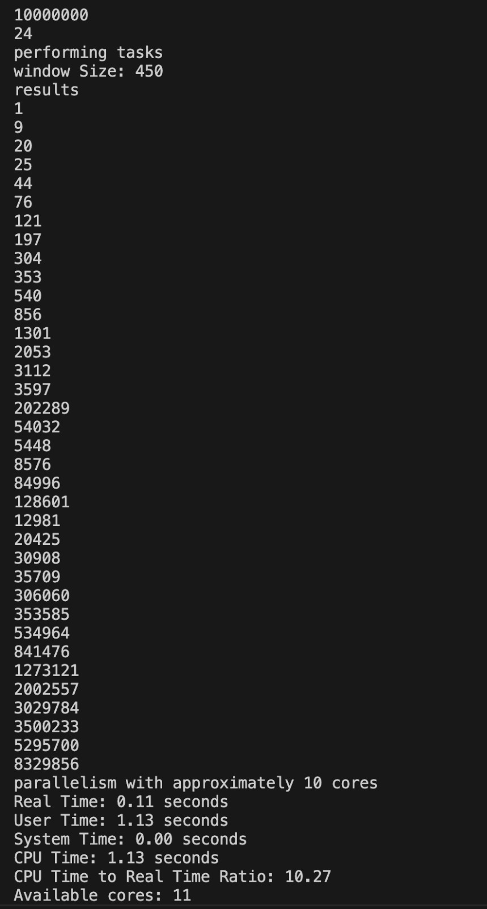

# COP5615 Project 1

## Team Members

- **Vennela Priya**  
  - UFID: 43793915

- **Chandan Abhishek**  
  - UFID: 87574794

## GitHub Repository

[GitHub Link](https://github.com/chandan25809/COP5615_Project_1)


# Project description

This project shows how to distribute tasks in parallel using actors in Pony. It divides a number of tasks among workers, where each worker handles a specific range of tasks and checks if the sum of squares within that range is a perfect square or not.

## Overview

The program uses three key actors: `Boss`, `Worker`, and `Main`. The `Boss` actor is responsible for managing task allocation and distributing work to the `Worker` actors, while the `Worker` actors process assigned tasks and check for perfect square sums. The `Main` actor serves as the entry point for the program.

## Actors and Functionality

### Boss Actor

- **Purpose**: Manages task allocation and distributes work to the workers.
- **Fields**:
  - `total_num: I64`: Total number of tasks to process.
  - `size: I64`: Group size for each worker.
  - `boss_env: Env`: The environment object used for I/O operations.
- **Constructor**: `create(n: I64, k: I64, env: Env)`
  - Initializes the total number of tasks, group size, and the environment.
- **Behavior**: `perform_tasks()`
  - Divides tasks into chunks with a work unit size.
  - It uses a sliding window approach to distribute tasks among workers.
  - Creates workers and assigns them a range of tasks to process.

### Worker Actor

- **Purpose**: Processes the assigned tasks and checks whether the sum of squares within the given range is a perfect square.
- **Fields**:
  - `_boss: Boss`: It refers the `Boss` actor.
  - `worker_env: Env`: The environment object used for I/O operations.
- **Constructor**: `create(boss: Boss, env: Env)`
  - Initializes the worker with a reference to the `Boss` and the environment.
- **Behavior**: `process_range(segment_start: I64, segment_end: I64, size: I64)`
  - Iterates through the given range and checks if the sum of squares is a perfect square using the `validate_perfect_square_sum` function.

### Helper Functions

- **validate_perfect_square_sum(segment_start: I64, size: I64): Bool**
  - Sums the squares of numbers in the range and checks if the sum is a perfect square.
- **calculate_sqrt(num: I64): I64**
  - Calculates the square root of a given number.

### Main Actor

- **Purpose**: Program's entry point.
- **Constructor**: `create(env: Env)`
  - Reads command-line arguments for the total number and group size.
  - Creates a `Boss` actor and initiates task distribution.

## Performance Optimization

With a work unit size of 450,the number of task allocations (from 10000000 / 450 ≈ 22222 units) ,which reduces communication costs and maintains effective parallelism. For example, when handling 10 million tasks, this setup divides them into about 22,222 chunks.

## Example Usage
To compile the code, use the following command:

```bash
ponyc .
```
To run the program, use the following command:

```bash
./calculate_time.sh ./dosp_project1 10000000 24
```
## Output



